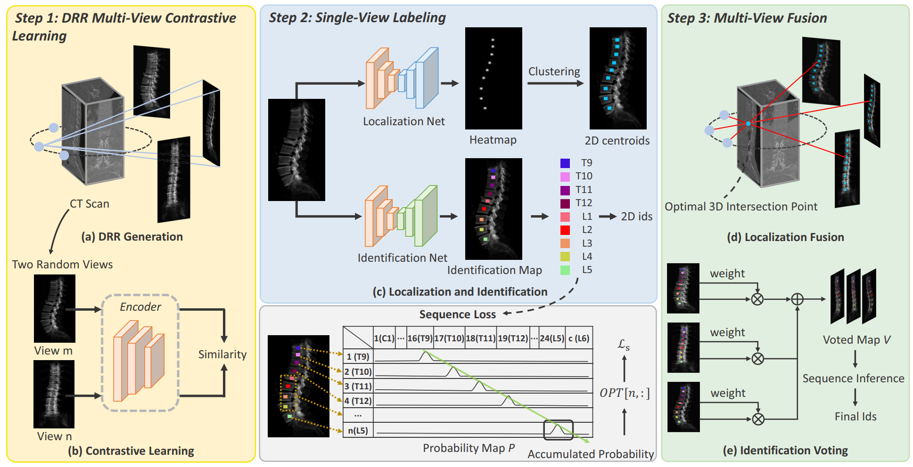

# Multi-View Vertebra Localization and Identification from CT Images
 by [Han Wu](http://hanwu.website/), Jiadong Zhang, [Yu Fang](https://yuffish.github.io/), Zhentao Liu, Nizhuan Wang, [Zhiming Cui](https://erdanc.github.io/) and [Dinggang Shen](http://idea.bme.shanghaitech.edu.cn/home/people/faculty).

## Introduction
This repository is the reference code for our paper 'Multi-View Vertebra Localization and Identification from CT Images' in MICCAI 2023.
[paper](https://arxiv.org/abs/2307.12845)
 


## Get Started
This repository is based on PyTorch 1.12.1 + Plastimatch 1.9.4.

### Installation
For installation of the Plastimatch, you can refer to [Plastimatch](https://plastimatch.org/).

### Training WorkFlow
1. Preprocess the data
```c
preprocess/preprocess.py
```
2. DRR Generation
```c
preprocess/generate_drr.py
preprocess/generate_drr_heatmap.py
```
3. Multi-View Contrastive Learning
```c
contrastive_learning/train_multi_view.py
```
4. Localization/ Identification network training
```c
train/train_localization.py
train/train_id_as_seg.py
```

### Inference WorkFlow
1. Preprocess the data
```c
preprocess/preprocess.py
```
2. DRR Generation
```c
preprocess/generate_drr.py
preprocess/generate_drr_heatmap.py
```
3. Single-View Localization & Identification
4. Multi-View Fusion
5. Evaluation
```c
# 3-5 are all in eval_all.py
eavl/eval_all.py
```
## Data Link
Public dataset:
- (VerSe'19 train): https://s3.bonescreen.de/public/VerSe-complete/dataset-verse19training.zip
- (VerSe'19 validation): https://s3.bonescreen.de/public/VerSe-complete/dataset-verse19validation.zip
- (VerSe'19 test): https://s3.bonescreen.de/public/VerSe-complete/dataset-verse19test.zip


## Citation
```c
@article{wu2023multiviewvert,
  title={Multi-View Vertebra Localization and Identification from CT Images},
  author={Han Wu, Jiadong Zhang, Yu Fang, Zhentao Liu, Nizhuan Wang, Zhiming Cui and Dinggang Shen},
  journal={International Conference on Medical Image Computing and Computer Assisted Intervention},
  year={2023}
}  
```
